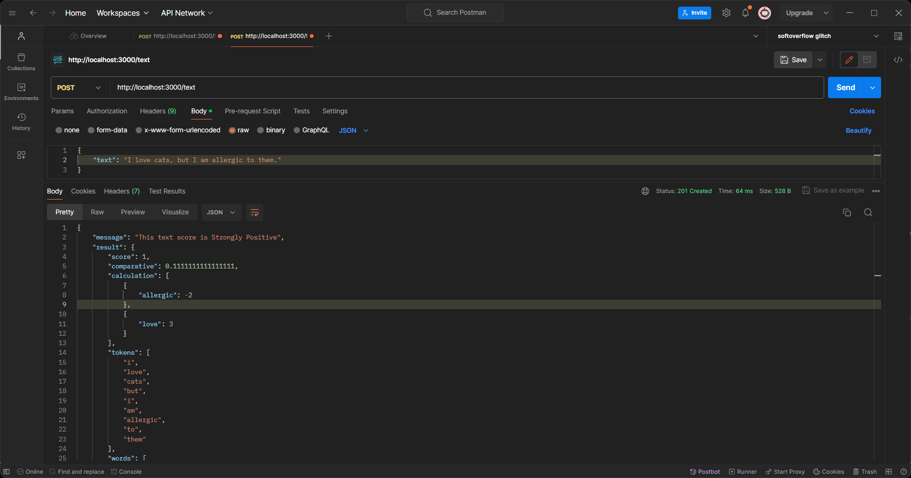

# Text Sentiment Scoring API. [GitHub Repo](https://github.com/oyedotunsodiq045/ai-sentiment-node-sentiment-app).

> Building a Sentiment Analysis Tool in JavaScript with AFINN-based sentiment analysis [sentiment](https://www.npmjs.com/package/sentiment) for Node.js [Node.js](https://nodejs.org/en)


## Quick Start

```bash
# Install dependencies
$ npx express-generator
$ npm i
$ npm i sentiment

# Serve on localhost:3000 (unix: macos/linux)
$ DEBUG=ai-sentiment-node-sentiment-app:* npm start:* npm start

# Serve on localhost:3000 (windows command prompt)
> set DEBUG=ai-sentiment-node-sentiment-app:* npm start:* & npm start

# Serve on localhost:3000 (windows powershell)
PS> $env:DEBUG='ai-sentiment-node-sentiment-app:*'; npm start
```

### Testing

| Routes                                                                               | Description                  |
| ------------------------------------------------------------------------------------ | ---------------------------- |
| POST &nbsp; &nbsp; &nbsp; http://localhost:3000/text                                 | Score text                   |


